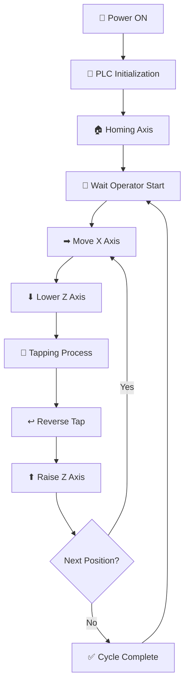

# 🔧 Tapping Auto 2 Axis


⚙️ Automation project for a **2-Axis Automatic Tapping Machine** using **Mitsubishi PLC** and **Samkoon HMI**.

This system automates tapping operations with two motion axes:

- **X Axis** → positioning to tapping location  
- **Z Axis** → tapping motion (down / up)

Designed for **industrial automation**, **machine retrofit**, and **production tapping stations**.

---

# 🏗 System Architecture

The control system follows a standard **industrial automation hierarchy**.

```
👤 Operator
   │
   ▼
🖥 HMI (Samkoon)
   │
   ▼
🧠 PLC (Mitsubishi)
   │
   ▼
⚙ Actuators
   ├─ X Axis Motor
   ├─ Z Axis Motor
   └─ Tapping Spindle
```

---

# 🔄 Machine Flow Chart



---

# ✨ Features

✔ Mitsubishi PLC based control  
✔ Samkoon HMI operator interface  
✔ Automatic tapping cycle  
✔ Dual axis motion control  
✔ Homing system  
✔ Emergency stop support  
✔ Expandable tapping positions  
✔ Industrial automation ready

---

# 🧰 Hardware Configuration

Typical machine setup:

| Component | Description |
|--------|--------|
| 🧠 PLC | Mitsubishi PLC |
| 🖥 HMI | Samkoon Touch HMI |
| ⚙ X Axis Motor | Stepper / Servo |
| ⚙ Z Axis Motor | Stepper / Servo |
| 🔌 Motor Driver | Stepper / Servo driver |
| 🛑 Limit Switch | Homing & safety |
| 🔋 Power Supply | 24V industrial power |

---

# ▶ Machine Operation

Typical operation sequence:

1️⃣ 🔌 Power ON machine  
2️⃣ 🧠 PLC initializes system  
3️⃣ 🏠 Axis homing process  
4️⃣ 👤 Operator presses **START** on HMI  
5️⃣ ➡ X axis moves to tapping position  
6️⃣ ⬇ Z axis lowers tapping tool  
7️⃣ 🔩 Tapping process begins  
8️⃣ ↩ Tap reverses  
9️⃣ ⬆ Z axis returns up  
🔟 🔁 Repeat for next position or finish

---

# 🔮 Future Development

Possible future improvements:

- 🔩 Multi-hole tapping pattern
- 🤖 Automatic workpiece clamping
- 📊 Production counter
- ⚡ Torque monitoring
- 🚨 Alarm diagnostics
- 🏭 Conveyor system integration

---

# 🚀 Download

- **Tapping Auto 2 Axis Project(Latest)**  
     <br>
  ➡️ [Release Page](https://github.com/viwaretech/tapping-servo-2axis/releases/latest)  
   ➡️ [Download Project](https://github.com/viwaretech/tapping-servo-2axis/releases/latest/download/tapping-servo-2axis.zip)

---


# 📜 License

This project is distributed under a **Commercial License**.

Use of this software requires **purchasing a license from the author**.

📄 Full license terms:

➡ **[LICENSE](LICENSE)**

---

# 👨‍💻 Author
**HARLEY AD**  
Industrial automation project for **2-axis tapping machine development** using **Mitsubishi PLC** and **Samkoon HMI**.

⚙️ Focus:  
Industrial Automation • PLC Programming • Machine Control Systems
